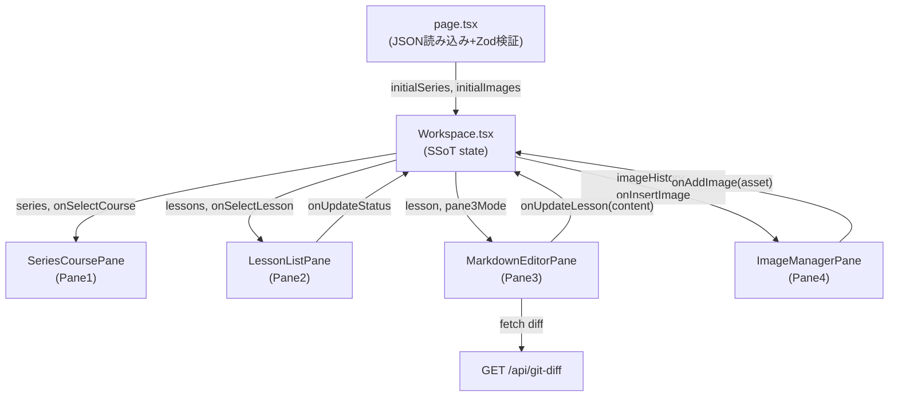

# DX Training Editor 実装プラン

## 参照ベース

workspace-ui-kit の構造を踏襲する。変更の差分が最小になるよう対応関係を明確にする。

- [`workspace-ui-kit/components/workspace/Workspace.tsx`](workspace-ui-kit/components/workspace/Workspace.tsx) — 状態管理の親コンポーネント（SSoT）
- [`workspace-ui-kit/lib/schema.ts`](workspace-ui-kit/lib/schema.ts) — Zod スキーマ定義のパターン
- [`workspace-ui-kit/app/globals.css`](workspace-ui-kit/app/globals.css) — カラートークンの定義方式（`@theme inline` + `:root`）
- [`workspace-ui-kit/app/page.tsx`](workspace-ui-kit/app/page.tsx) — JSON 読み込み + Zod 検証パターン

---

## ディレクトリ構成

workspace-ui-kit のディレクトリをそのまま複製して名称変更する。

```
dx-training-editor/
  app/
    page.tsx             既存パターンで JSON 読み込み・Zod 検証・Workspace に渡す
    layout.tsx
    globals.css          カラートークンを DX Training Editor パレットに差し替え
    api/
      git-diff/
        route.ts         git diff HEAD <path> を実行する API ルート
  components/
    workspace/
      Workspace.tsx      中央状態管理（setState + props フロー）
      SeriesCoursePane.tsx    Pane1（旧 PositionPane）
      LessonListPane.tsx      Pane2（旧 CandidateListPane）
      MarkdownEditorPane.tsx  Pane3（旧 CandidateDashboardPane）
      ImageManagerPane.tsx    Pane4（旧 CandidateDetailPane）
      GlobalHeader.tsx
    ui/                  shadcn コンポーネント（変更なし）
    primitives/          既存ユーティリティコンポーネント（流用）
  lib/
    schema.ts            新しい Zod スキーマ（下記参照）
    utils.ts             cn() + ステータス自動計算ヘルパー
  data/
    workspace.json       { name: "DX Training Editor", icon: "graduation-cap" }
    content.json         シリーズ→コース→レッスンのサンプルデータ
    images.json          画像履歴のサンプルデータ（data URL）
  hooks/
    useImageHistory.ts   画像アセット管理フック
```

---

## データスキーマ（lib/schema.ts）

```typescript
// レッスン（葉ノード）
const lessonSchema = z.object({
  id: z.string(),
  series: z.string(),
  course: z.string(),
  lesson: z.string(),
  status: z.enum(['draft', 'in_progress', 'done']),
  description: z.string(),
  tags: z.array(z.string()),
  estimated_minutes: z.number(),
  author: z.string(),
  content: z.string(), // マークダウン本文
})

// コース → レッスン（曼陀羅メタ情報を含む）
const courseSchema = z.object({
  id: z.string(),
  name: z.string(),
  target_audience: z.string().optional(),       // 想定する受講対象者
  prerequisites: z.array(z.string()).default([]), // 前提コースIDリスト
  next_courses: z.array(z.string()).default([]),  // 次のコースIDリスト
  lessons: z.array(lessonSchema),
})

// シリーズ → コース
const seriesSchema = z.object({
  id: z.string(),
  name: z.string(),
  courses: z.array(courseSchema),
})
```

ステータス自動計算は `lib/utils.ts` に純粋関数として実装：

```typescript
function computeStatus(statuses: Status[]): Status {
  if (statuses.every(s => s === 'draft')) return 'draft'
  if (statuses.every(s => s === 'done')) return 'done'
  return 'in_progress'
}
```

---

## 状態管理（Workspace.tsx）

既存の "親が SSoT・props で子に渡す" パターンを維持する。

```typescript
// 主要 useState
const [series, setSeries] = useState<Series[]>(initialSeries)
const [selectedCourseId, setSelectedCourseId] = useState<string>('')
const [selectedLessonId, setSelectedLessonId] = useState<string>('')
const [pane3Mode, setPane3Mode] = useState<'inline' | 'raw' | 'diff'>('inline')
const [pane4ManuallyClosed, setPane4ManuallyClosed] = useState(false)
const [imageHistory, setImageHistory] = useState<ImageAsset[]>(initialImages)

// 派生（useMemo）
const selectedCourse = useMemo(...)
const selectedLesson = useMemo(...)
const pane4Open = !pane4ManuallyClosed
```

---

## ペイン別の実装方針

### Pane 1 — SeriesCoursePane

- 既存 `PositionPane` の shadcn `<Sidebar collapsible="icon">` と `Pane1Toggle` を流用
- 内部を「グローバル進捗バー → シリーズ折りたたみアコーディオン → コース一覧」に置き換え
- 進捗バーは shadcn `<Progress>` コンポーネントを使用

### Pane 2 — LessonListPane

**上部：コースメタ情報エリア**

- コースメタ情報テーブル（受講対象者・前提コース・次のコース）を表示
- 前提コース・次のコースの名前はクリック可能 → Pane1のコース選択をジャンプ
- `[編集]` ボタン → コース設定ダイアログ（target_audience / prerequisites / next_courses を編集）
- Mermaidミニグラフ：`prerequisites → 現在のコース → next_courses` を動的生成
  - `mermaid` パッケージをクライアントサイドでレンダリング
  - コースメタデータから自動的にMermaid定義文字列を生成
  - 例: `flowchart LR\n  A["Git概念"] --> C["★本コース★"]\n  C --> D["Gitブランチ"]`

**下部：レッスン一覧**

- 既存 `CandidateListPane` の DnD（`@dnd-kit`）と CRUD ダイアログパターンを流用
- コース進捗バー（done件数/総件数）を最上部に配置
- ステータスバッジは shadcn `<Badge>` で 3 色（`computeStatus` の結果で色分け）

**追加依存パッケージ**: `mermaid`

### Pane 3 — MarkdownEditorPane（最複雑）

3 モードをトグルボタンで切り替え。段階的に実装する：

- **フェーズ A（最初）**: モードトグル UI + 生マークダウン編集（`<textarea>` or Monaco）+ `react-markdown` によるプレビュー
- **フェーズ B（後で）**: Notion 風インライン編集（ブロック単位クリック編集）
- **差分表示モード**: `GET /api/git-diff?path=<filepath>` を呼び出して `@monaco-editor/react` の diff ビューワで表示

ファイル読み込みは 2 経路：
- ファイルピッカー（`<input type="file" accept=".md">`）→ `FileReader.readAsText()`
- テキストエリアへの直接ペースト

### Pane 4 — ImageManagerPane

- 既存 `CandidateDetailPane` の `w-[400px]`↔`w-12` 開閉パターンを流用
- 内部を 4 タブ（アップロード・履歴・AI生成・Web検索）に置き換え
- アップロードタブ: `onDrop` + `onPaste` イベントで `FileReader` 経由で画像を data URL に変換、`imageHistory` に追加
- 履歴タブ: サムネイルグリッド表示、クリックで `onInsertImage(markdownSnippet)` を呼び、Pane3 のカーソル位置に `` を挿入
- AI生成・Web検索タブ: "準備中" のプレースホルダー UI

### API ルート — /api/git-diff

```typescript
// app/api/git-diff/route.ts
import { execSync } from 'child_process'
export async function GET(req: Request) {
  const path = new URL(req.url).searchParams.get('path')
  const diff = execSync(`git diff HEAD -- "${path}"`, { cwd: process.cwd() }).toString()
  return Response.json({ diff })
}
```

---

## カラートークン（globals.css）

`:root` の CSS 変数を差し替える。`@theme inline` のエイリアス構造は維持する。

```css
:root {
  --primary: #007BC0;        /* Custom_Blue_50 */
  --primary-hover: #006EAD;  /* Custom_Blue_45 */
  --background: #EFF1F2;     /* Custom_Gray_95 */
  --card: #FFFFFF;
  --border: #D0D4D8;         /* Custom_Gray_85 */
  --foreground: #1A1C1D;     /* Custom_Gray_10 */
  --muted-foreground: #71767C; /* Custom_Gray_50 */
  /* ステータスカラー */
  --status-done: #00884A;    /* Custom_Green_50 */
  --status-wip: #EEC100;     /* Custom_Yellow_80 */
  --status-draft: #A4ABB3;   /* Custom_Gray_70 */
}
```

---

## データフロー図



---

## コンポーネント対応表

| workspace-ui-kit | DX Training Editor | 変更規模 |
|---|---|---|
| `PositionPane` | `SeriesCoursePane` | 中（骨格流用・中身書き換え） |
| `CandidateListPane` | `LessonListPane` | 中（DnD・ダイアログ流用） |
| `CandidateDashboardPane` | `MarkdownEditorPane` | 大（新規実装） |
| `CandidateDetailPane` | `ImageManagerPane` | 大（新規実装） |
| `lib/schema.ts` | `lib/schema.ts` | 全面書き換え |
| `data/*.json` | `data/*.json` | 全面書き換え |
| `app/globals.css` | `app/globals.css` | カラー変数のみ差し替え |
