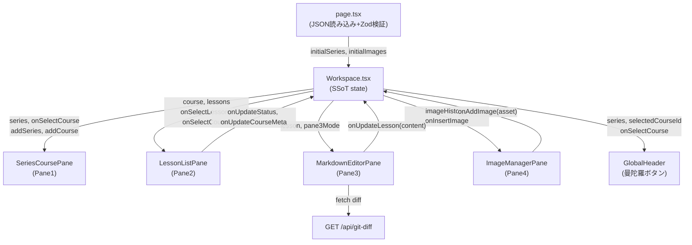

# DX Training Editor 実装プラン

## 参照ベース

workspace-ui-kit の構造を踏襲する。変更の差分が最小になるよう対応関係を明確にする。

- [`workspace-ui-kit/components/workspace/Workspace.tsx`](workspace-ui-kit/components/workspace/Workspace.tsx) — 状態管理の親コンポーネント（SSoT）
- [`workspace-ui-kit/lib/schema.ts`](workspace-ui-kit/lib/schema.ts) — Zod スキーマ定義のパターン
- [`workspace-ui-kit/app/globals.css`](workspace-ui-kit/app/globals.css) — カラートークンの定義方式（`@theme inline` + `:root`）
- [`workspace-ui-kit/app/page.tsx`](workspace-ui-kit/app/page.tsx) — JSON 読み込み + Zod 検証パターン

---

## ディレクトリ構成

```
dx-training-editor/
  app/
    page.tsx             JSON 読み込み・Zod 検証・Workspace に渡す
    layout.tsx           タイトル "DX Training Editor"・favicon 🎓
    globals.css          カラートークン・ステータスカラー定義
    api/
      git-diff/
        route.ts         git diff HEAD <path> を実行する API ルート
  components/
    workspace/
      Workspace.tsx      中央状態管理（setState + props フロー）
      SeriesCoursePane.tsx    Pane1
      LessonListPane.tsx      Pane2
      MarkdownEditorPane.tsx  Pane3
      ImageManagerPane.tsx    Pane4
      GlobalHeader.tsx        パンくず + 曼陀羅ボタン
    ui/                  shadcn コンポーネント
    primitives/          ユーティリティコンポーネント
  lib/
    schema.ts            Zod スキーマ（Series/Course/Lesson）
    utils.ts             cn() + computeStatus ヘルパー
  data/
    workspace.json
    content.json         シリーズ→コース→レッスンのサンプルデータ
    images.json          画像履歴サンプルデータ
  hooks/
    useImageHistory.ts   画像アセット管理フック
```

---

## データスキーマ（lib/schema.ts）

```typescript
const lessonSchema = z.object({
  id: z.string(),
  series: z.string(),
  course: z.string(),
  lesson: z.string(),
  status: z.enum(['draft', 'in_progress', 'done']),
  description: z.string(),
  tags: z.array(z.string()),
  estimated_minutes: z.number(),
  author: z.string(),
  content: z.string(),
})

const courseSchema = z.object({
  id: z.string(),
  name: z.string(),
  target_audience: z.string().optional(),
  prerequisites: z.array(z.string()).default([]),
  next_courses: z.array(z.string()).default([]),
  lessons: z.array(lessonSchema),
})

const seriesSchema = z.object({
  id: z.string(),
  name: z.string(),
  courses: z.array(courseSchema),
})
```

ステータス自動計算（`lib/utils.ts`）:

```typescript
function computeStatus(statuses: Status[]): Status {
  if (statuses.every(s => s === 'draft')) return 'draft'
  if (statuses.every(s => s === 'done')) return 'done'
  return 'in_progress'
}
```

---

## 状態管理（Workspace.tsx）

```typescript
const [series, setSeries] = useState<Series[]>(initialSeries)
const [selectedCourseId, setSelectedCourseId] = useState<string>('')
const [selectedLessonId, setSelectedLessonId] = useState<string>('')
const [pane3Mode, setPane3Mode] = useState<'inline' | 'raw' | 'diff'>('inline')
const [pane4ManuallyClosed, setPane4ManuallyClosed] = useState(false)
const [imageHistory, setImageHistory] = useState<ImageAsset[]>(initialImages)

const selectedCourse = useMemo(...)
const selectedLesson = useMemo(...)
```

---

## ペイン別の実装方針と実装済み内容

### Pane 1 — SeriesCoursePane ✅

- shadcn `<Sidebar collapsible="icon">` を使用
- 構成：グローバル進捗バー（完了レッスン数/総レッスン数・%）→ シリーズ折りたたみ → コース一覧
- **ステータスアイコン**: `CircleCheck`（完成）/ `Loader`（作成中）/ `CircleDashed`（未着手）
- **進捗表示**: シリーズ = 完了コース数/総コース数、全体 = 完了レッスン数/総レッスン数（%）
- **DnD**: コースの並び替え（同一シリーズ内のみ）。`@dnd-kit` を使用。`DndContext` に `id` を付与してハイドレーション不一致を防止
- **追加ボタン**: 「シリーズを追加」（グローバル）・「コースを追加」（シリーズごと）
- **サイドバー収納時**: 開閉ボタン以外のコンテンツをすべて非表示（縦並び文字化けを防止）
- **選択/ホバー色**: 選択中 `bg-accent`（薄青）、ホバー `bg-muted`（薄グレー）

### Pane 2 — LessonListPane ✅

**上部：コースメタ情報エリア**

- コース名（左）＋ ステータスアイコン（右）
- メタ情報テーブル: `対象:` / `前回:` / `次回:` を幅 `w-8` で左揃え統一
- 前回・次回のコース名はクリック可能 → `onSelectCourse` でジャンプ
- `[編集]` ボタン（鉛筆アイコン）→ コースメタ編集ダイアログ
- **Mermaid ミニグラフ**（`flowchart LR`）:
  - サムネイルを常時表示、クリックで拡大モーダルを開く
  - ノードは丸みを持った stadium 形式 `("text")` で統一
  - テーマ: `base`（黄色系）
  - 現在のコースノードに `style CURRENT stroke-width:3px,font-weight:bold` を適用
  - ノードをクリックするとそのコースに移動（`window.miniGraphNav` コールバック方式）
  - モーダル open 時に lazy レンダリング、`useEffect` で `bindFunctions` を呼ぶ（GlobalHeader と同一パターン）
  - クリックイベントは `e.nativeEvent.composedPath()` で foreignObject 境界を越えて走査

**下部：レッスン一覧**

- コース進捗バー（完了件数/総件数）
- DnD 並び替え（`@dnd-kit`）。`DndContext id="lesson-list-dnd"` でハイドレーション不一致を防止
- レッスン行のレイアウト: ドラッグハンドル / レッスン名（左寄せ・flex-1）/ 削除ボタン / ステータスアイコン（右端）
- 削除ボタン・ステータスアイコンはサイズ `h-3.5 w-3.5`、アイコン間に `ml-1`
- 削除ボタンクリック → 確認モーダル（Radix Dialog）を経由して削除
- ステータスアイコンクリック → draft → in_progress → done とサイクル切り替え
- 「レッスンを追加」ボタン → レッスン追加ダイアログ

### Pane 3 — MarkdownEditorPane ✅（フェーズ A）

- 3モードトグル: プレビュー（`react-markdown`）/ 生Markdown（`<textarea>`）/ Git差分（Monaco diff）
- ファイル読み込み: ファイルピッカー（`<input type="file" accept=".md">`）
- 差分表示: `GET /api/git-diff?path=<filepath>` → Monaco diff ビューワ
- 貼り付けボタンは廃止（不要なため）
- フェーズ B（Notion 風インライン編集）は未着手

### Pane 4 — ImageManagerPane ✅

- `w-[400px]` ↔ `w-12` の開閉パターン
- 4タブ: アップロード / 履歴 / AI生成（モック）/ Web検索（モック）
- アップロード: ドラッグ&ドロップ（`onDrop`）＋クリップボードペースト（`onPaste`）で data URL 化
- 履歴: サムネイルグリッド、クリックで `` を Pane3 カーソル位置に挿入
- 「Ctrl+V で貼り付けも可」の文言は廃止（不要なため）

### GlobalHeader ✅

- パンくず（シリーズ > コース > レッスン）
- **曼陀羅ボタン** → 全コース依存グラフをフルスクリーンモーダルで表示
  - `flowchart TD`（Top-Down）形式
  - シリーズを `subgraph` で囲む
  - 全ノードを stadium 形式 `("text")` で統一
  - テーマ: `base`（黄色系）。`securityLevel: "loose"` で click ディレクティブを有効化
  - 現在選択中のコースに「★ 」プレフィックス + `style N_xxx stroke-width:3px,font-weight:bold`
  - ノードクリック → `window.mandalaNav` コールバック → `onSelectCourse` + モーダルを閉じる
  - クリックイベントは `e.target.closest("g")` で SVG g 要素を探索
  - 脚注「★ = 現在選択中のコース　ノードをクリックするとそのコースに移動します」を表示

### API ルート — /api/git-diff ✅

```typescript
// app/api/git-diff/route.ts
import { execSync } from 'child_process'
export async function GET(req: Request) {
  const path = new URL(req.url).searchParams.get('path')
  const diff = execSync(`git diff HEAD -- "${path}"`, { cwd: process.cwd() }).toString()
  return Response.json({ diff })
}
```

---

## カラートークン（globals.css）

```css
:root {
  --primary: #007BC0;          /* Custom_Blue_50 */
  --primary-hover: #006EAD;    /* Custom_Blue_45 */
  --background: #EFF1F2;       /* Custom_Gray_95 */
  --card: #FFFFFF;
  --border: #D0D4D8;           /* Custom_Gray_85 */
  --foreground: #1A1C1D;       /* Custom_Gray_10 */
  --muted-foreground: #71767C; /* Custom_Gray_50 */
  /* ステータスカラー */
  --status-done: #00884A;      /* Custom_Green_50 */
  --status-wip: #EEC100;       /* Custom_Yellow_80 */
  --status-draft: #9AA0A6;     /* Custom_Gray_70（やや薄め） */
}
```

---

## Mermaid インタラクションの実装パターン

Mermaid v11 で click ディレクティブを使ったナビゲーションを実装する際の安定パターン：

```
1. mermaid.initialize({ startOnLoad: false, theme: "base", securityLevel: "loose" })
2. モーダルが開いたタイミングで mermaid.render() を呼ぶ（lazy render）
3. render() の戻り値 bindFunctions を useRef に保存
4. SVG を dangerouslySetInnerHTML でコンテナ div に描画
5. useEffect([svg]) で bindFunctions(containerRef.current) を呼ぶ
6. コンテナ div の onClick で e.nativeEvent.composedPath() を走査
7. SVGGElement かつ ID が /-flowchart-(N_xxx)-/ にマッチする要素を探す
8. window.xxxNav(nodeId) を呼んでナビゲーション実行
```

**ポイント**:
- `closest("g")` は foreignObject 内の HTML 要素から SVG 親を辿れないケースがある → `composedPath()` を使う
- モーダルが閉じている状態で render すると bindFunctions 呼び出しのタイミングがずれる → 必ず open 後に render する
- ノード ID に使う文字列は `[^a-zA-Z0-9]` を `_` に置換してアルファベット/数字/アンダースコアのみにする
- `classDef` + `:::className` よりも `style nodeId property:value` の方がパースが安定する

---

## データフロー図



---

## コンポーネント対応表

| workspace-ui-kit | DX Training Editor | 変更規模 |
|---|---|---|
| `PositionPane` | `SeriesCoursePane` | 中（骨格流用・中身書き換え） |
| `CandidateListPane` | `LessonListPane` | 中（DnD・ダイアログ流用） |
| `CandidateDashboardPane` | `MarkdownEditorPane` | 大（新規実装） |
| `CandidateDetailPane` | `ImageManagerPane` | 大（新規実装） |
| `GlobalHeader` | `GlobalHeader` | 中（パンくず流用・曼陀羅追加） |
| `lib/schema.ts` | `lib/schema.ts` | 全面書き換え |
| `data/*.json` | `data/*.json` | 全面書き換え |
| `app/globals.css` | `app/globals.css` | カラー変数差し替え |

---

## 残タスク（フェーズ B）

- [ ] **Pane3 Notion 風インライン編集モード** — ブロック単位クリック編集（実装難度: 高）
- [ ] **データ永続化** — Git リポジトリへの保存（現在はセッション内 state のみ）
- [ ] **確認問題機能** — レッスン末尾の確認問題 UI（grill-me.md で詳細定義）
- [ ] **ゲーミフィケーション** — 受講進捗バッジ・レベルアップ演出
