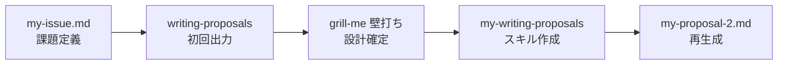

# my-writing-proposals スキル開発 — 現状報告

日付: 2026/07/11  
報告者: mindチーム 北村

---

## 1. 何をやっているか

社内向けの提案文を AI で生成するスキルを、自分の課題に合わせてカスタマイズしている。

| 項目 | 内容 |
|------|------|
| ベーススキル | `writing-proposals`（対話で材料を引き出し、提案文を生成） |
| カスタムスキル | `my-writing-proposals`（会社向け・日英・短尺・パーパス整合） |
| 配置場所 | `my-proposals/.claude/skills/my-writing-proposals/` |
| 検証用の課題 | `my-issue.md`（3ペインワークスペース導入と AI API チームプラン承認） |

**ゴール**: 課長（ドイツ人・論理・コスト重視）と部長（日本人・AI 推進に積極的）に出す提案文を、短く・論理的に・日英で書けるようにする。

---

## 2. 経緯（3段階）



### Step 1: 初回出力（Before）

- **入力**: `my-issue.md`
- **スキル**: `writing-proposals`
- **出力**: `proposals/ads-proposal-original.md`（約 67 行）

**課題だった点**:

- 文章が長すぎる（忙しい決裁者が読み切れない）
- 英語版がない（課長向けに必要）
- 会社・部のミッション／パーパスとの紐づけがない
- 結論は先出しされているが、全体として情報量が多い

### Step 2: 設計の壁打ち

- **手法**: `grill-me` スキルで 1 問ずつ設計を詰めた
- **記録**: `docs/grill-me-20260711.md`

ここで決まった主な設計:

| 論点 | 決定内容 |
|------|----------|
| 出力の長さ | 各言語版 15〜20 行固定 |
| 日英 | 同じ論点・同じトーン。1 出力内で `## 日本語版` / `## English Version` |
| テンプレート | 結論 → コスト vs ベネフィット → 現状 → 推奨 → リスク |
| パーパス | 全体整合が主。自然な接点があるときだけ 1 文で織り込む |
| 対話 | 5 材料フロー継承。入力にあればスキップ。選択肢は最大 3 案 |

### Step 3: カスタムスキルで再生成（After）

- **スキル**: `my-writing-proposals`（新規作成）
- **出力**: `proposals/my-proposal-2.md`（各言語版 約 20 行）

**改善できた点**:

| 改善項目 | Before | After |
|----------|--------|-------|
| 長さ | 約 67 行（日本語のみ） | 各言語版 15〜20 行 |
| 英語 | なし | 日本語版と同論点の英語版を併記 |
| パーパス | なし | 全体整合を確認する仕組みを追加（独立セクションは作らない） |
| 構造 | セクションが多く冗長 | 固定テンプレートで情報階層を統一 |
| コスト対比 | 文中に散在 | 冒頭直後にコスト vs ベネフィットを明示 |

---

## 3. 現状の残課題（6 点）

短尺化・日英併記・パーパス整合は達成したが、**上司に出す文章としての品質**にはまだギャップがある。

### 課題 1: 削りすぎでぶっきらぼう

15〜20 行制約のために背景や接続を削った結果、言い回しが事務的・命令調に寄っている。

> 例（my-proposal-2）: 「3ペインAIワークスペースの試験導入（3〜5名・4週間）を承認いただきたい。」

→ 論理は通るが、**丁寧さ・説得力のある語り**が不足している。

### 課題 2: 体言止めが多い

短文化ルール（一文一義・30 字目安）の副作用で、体言止め・名詞連結が増えた。上司向けの正式な提案文としては不適切な印象を与えやすい。

> 例: 「配布課題の解消を確認」「判断材料になる」「品質要件は次段階で判断」

### 課題 3: 計画の観点が弱い

パイロット → 本格展開 → 判断時期、という**段階的な実行計画**が読み取りにくい。

現状の出力では:

- 4 週間パイロットは書いてある
- その後どう判断するか（成功基準・判断日・次の申請内容）はリスク欄に散在
- 「いつ・何をもって・誰が・次に何を決めるか」が一文で追えない

### 課題 4: 論理の流れが追いにくい

読者が自然に辿れるべき流れ:

```
組織の課題 → 解決したいこと → そのために何をやる → 何が足りない → 何を提案する → 何を承認してほしいか
```

現状のテンプレートは **コスト対比・現状・推奨・リスク** の並びであり、**課題 → 解決策 → 承認依頼** のストーリーラインが弱い。セクションを読んでも「なぜ今これが必要か」が後からしか分からない。

### 課題 5: PREP 構造になっていない

理想的な論理展開（PREP）:

| 要素 | 意味 | 現状 |
|------|------|------|
| **P**oint | 結論（何を承認してほしいか） | △ 冒頭にあるが、その後の展開と対応が弱い |
| **R**eason | なぜそう言えるか | △ コスト対比に偏り、課題との因果が薄い |
| **E**xample / Evidence | 根拠・具体例 | △ 数字はあるが体験談・実績の語りが削られている |
| **P**oint | 結論の再確認 | ✕ 末尾に結論の再提示がない |

### 課題 6: 模範回答例がない

スキルの `references/` には文章ルール・パーパス・品質チェックリストはあるが、**「この課題に対する最高の回答例」** がない。AI が短尺ルールだけを守り、文体の良し悪しの基準がぶれやすい。

---

## 4. Before / After の抜粋比較

### 結論文

**Before**（ads-proposal-original）:

> 部全体でAI APIチームプラン（月250€）の承認と、3ペインワークスペースの部内導入をお願いします。個別のCopilot申請を全員に求めるより、コストと運用の両面で合理的です。

**After**（my-proposal-2）:

> 【提案】3ペインAIワークスペースの試験導入（3〜5名・4週間）を承認いただきたい。APIは現行ベーシックのまま進めます。

→ After は短く具体的だが、**理由が結論に付いていない**（PREP の R が欠落）。

### 課題の語り方

**Before**:

> 社内では便利なAIスキルを多数開発しており、部外メンバーからも好評をいただいています。一方、部内への配布と実行環境の整備がボトルネックになっています。

**After**:

> ・社内で有用なAIスキルを多数開発しているが、実行にはVSCode＋Copilot申請が必要

→ After は事実だけが並び、**課題の意味づけと解決の方向性**が薄い。

---

## 5. スキルの現状構成

```
my-proposals/.claude/skills/my-writing-proposals/
├── SKILL.md                      # 対話フロー・テンプレート・行数制約
└── references/
    ├── company-purpose.md        # 部パーパス（ダミー10箇条）
    ├── writing-essence.md        # 文章ルールのエッセンス
    └── output-quality.md         # 出力前チェックリスト
```

**足りないもの**: 模範回答例（`references/` 配下に配置する想定）

---

## 6. 次にやること（案）

優先度順の改善候補:

| # | 改善内容 | 期待効果 |
|---|----------|----------|
| 1 | **模範回答例**を `references/` に追加 | 文体・丁寧さ・PREP の具体基準を AI に示せる |
| 2 | テンプレートを **PREP + 計画** 構造に改修 | 課題→解決→承認依頼の流れと、パイロット後の判断が読み取れる |
| 3 | 行数制約を **「15〜20 行」から「15〜25 行」** 等に緩和、または **丁寧さ用の行を確保** | 削りすぎ・ぶっきらぼうさの緩和 |
| 4 | 文章ルールに **体言止め禁止・文末の丁寧さ** を明記 | 上司向けとして不適切な文体を防ぐ |
| 5 | `my-issue.md` で再生成し、Before / After / 改善後を 3 点比較 | 改善の効果を定量的に確認 |

---

## 7. 関連ファイル一覧

| ファイル | 役割 |
|----------|------|
| `my-issue.md` | 検証用の課題定義（変えたいこと・決裁者・社内課題） |
| `proposals/ads-proposal-original.md` | Before（writing-proposals の出力） |
| `proposals/my-proposal-2.md` | After（my-writing-proposals の出力） |
| `docs/grill-me-20260711.md` | スキル設計の壁打ち記録 |
| `.claude/skills/my-writing-proposals/SKILL.md` | カスタムスキル本体 |

---

## 8. まとめ

- `writing-proposals` から `my-writing-proposals` へ進化させ、**短さ・日英・パーパス整合** は大きく改善した
- 一方、短尺化の副作用として **丁寧さ・論理の流れ・段階的計画・PREP 構造** が失われている
- 次の焦点は「短く保ちつつ、上司が読んで承認できる品質の文章にする」こと
- そのための具体策として、**模範回答例の追加** と **テンプレート／文章ルールの改修** が最優先
